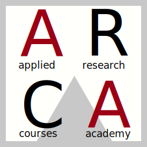

# ARCA (Applied Research Courses Academy)

I corsi ARCA sono dei corsi avanzati e fortemente applicativi riguardo gli strumenti moderni per la ricerca in Psicologia. Sono organizzati dal Dipartimento di Psicologia dello Sviluppo e della Socializzazione presso l'Università degli Studi di Padova. Al link [dpss.unipd.it/arca](https://www.dpss.unipd.it/arca) è possibile avere informazioni dettagliate su tutti i corsi attivi.

# ARCA - Introduzione a R

Questa è la repository principale del corso dove ci saranno tutte le informazioni, slides, link e materiale. 
Il materiale è stato adattato dal corso tenuto da [Filippo Gambarota](https://github.com/arca-dpss/course-R) negli scorsi anni.

Il principale materiale di riferimento è il libro: [Introduzione a R](https://psicostat.github.io/Introduction2R/). Il libro, in costante aggiornamento e miglioramento, è disponibile online ed è interamente open-source.

# Aule e orari

| Data       | Ora          | Aula                |
|------------|--------------|---------------------|
| 10/10/2025 | 13:00 - 17:00| Psico 1 - Aula ARCA |
| 11/10/2025 | 9:00 - 13:00 | Psico 1 - Aula ARCA |
| 12/10/2025 | 9:00 - 13:00 | Psico 1 - Aula ARCA |
| 13/10/2025 | 9:00 - 12:30 | Psico 1 - Aula ARCA |
| 14/10/2025 | 9:00 - 13:30 | Psico 1 - Aula ARCA |

