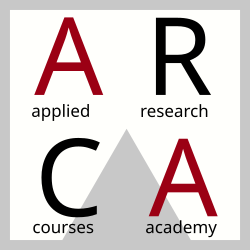

# ARCA (Applied Research Courses Academy)

ARCA courses are advanced, strongly hands-on courses on modern tools for research in Psychology. They are organized by the Department of Developmental Psychology and Socialisation (DPSS) at the University of Padova. Detailed information on all active courses is available at [dpss.unipd.it/arca](https://www.dpss.unipd.it/arca).

# ARCA - Introduction to R

This is the main repository of the course, where you will find all the information, slides, links and material.
The material has been adapted from the course taught by [Filippo Gambarota](https://github.com/arca-dpss/course-R) in previous years.

The main reference material is the book [Introduzione a R](https://psicostat.github.io/Introduction2R/) (in Italian). The book is constantly being updated and improved, and is available online and fully open-source.

# Rooms and schedule

| Date                 | Time         | Room                |
|----------------------|--------------|---------------------|
| Monday 19/10/2026    | 9:00 - 13:00 | Psico 1 - Aula ARCA |
| Wednesday 21/10/2026 | 9:00 - 13:00 | Psico 1 - Aula ARCA |
| Friday 23/10/2026    | 9:00 - 13:00 | Psico 1 - Aula ARCA |
| Tuesday 27/10/2026   | 9:00 - 13:00 | Psico 1 - Aula ARCA |
| Thursday 29/10/2026  | 9:00 - 13:00 | Psico 1 - Aula ARCA |
