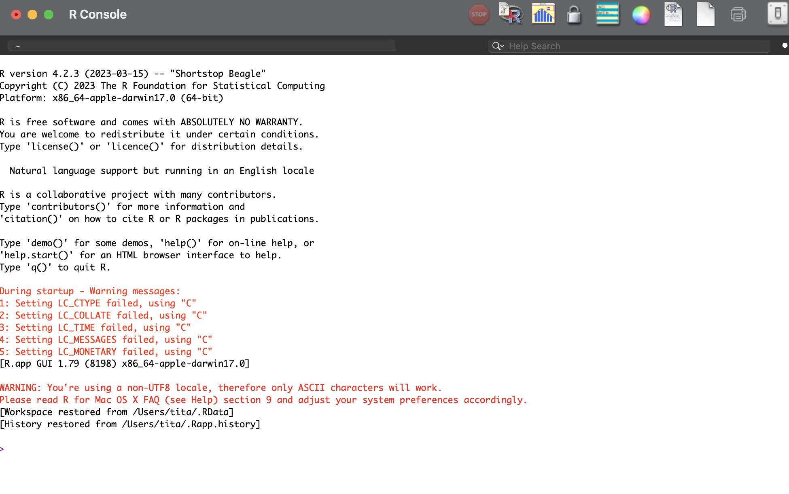
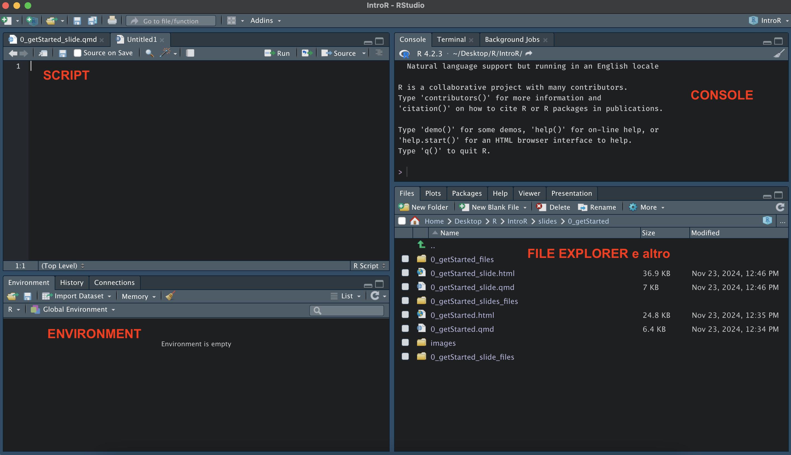
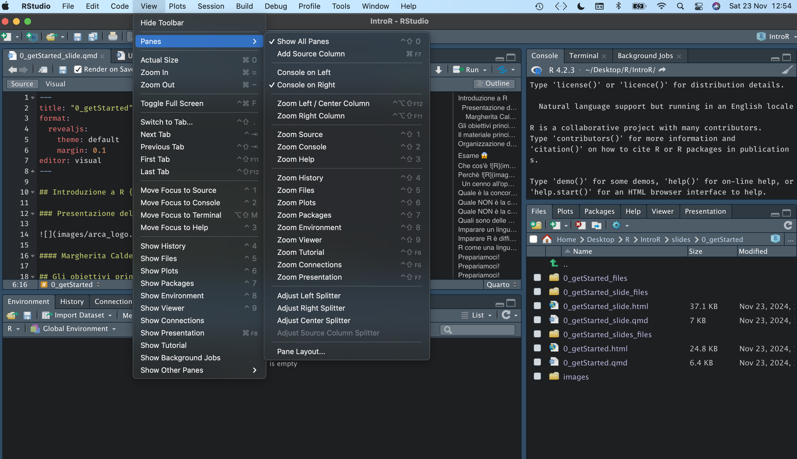
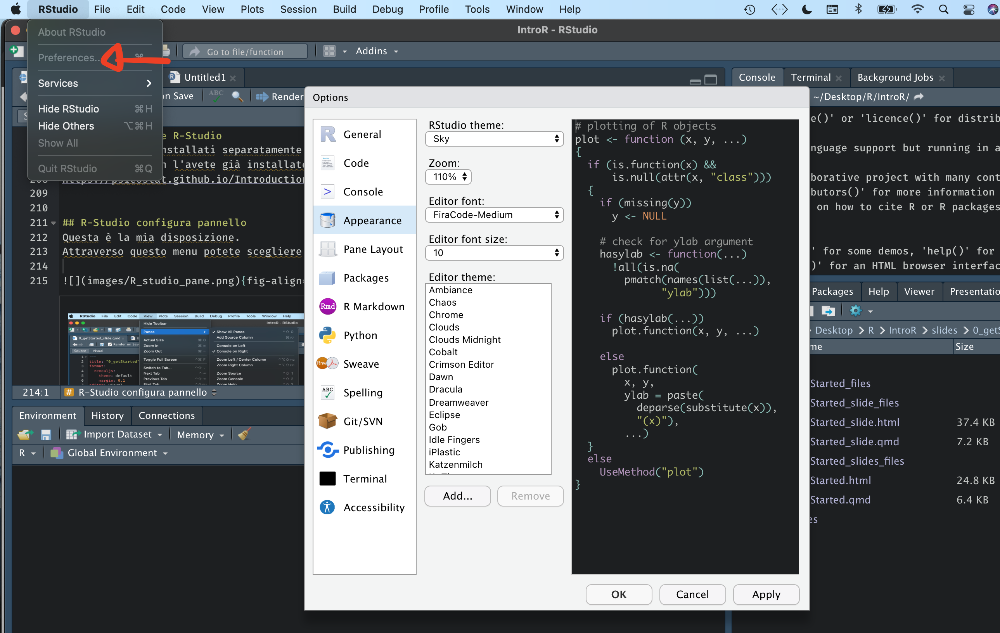

## What is {fig-align="center" width="80"}

[**R**](https://www.r-project.org/) is a programming language strongly oriented towards statistics, data management and visualization.

It was created in 1993 by **Ross Ihaka** and **Robert Gentleman**.

It is completely **open-source** and **free** software, constantly evolving and changing.

## Why {fig-align="center" width="80"}

### A word on open-source

A piece of software is called open-source when its **source code is available** to everyone to be **modified**, **updated** and **inspected**.

R is **both open-source and free**, and it has an extremely active community, as often happens with open-source projects and programming languages in general.

## Who are the competitors?

R's main "competitor" is certainly **Python**, which offers an equally powerful, well-developed and active environment.

It is not easy (and maybe not even possible) to say which one is better.

In any case, once you have learned R, learning Python will be very easy.

## Who are NOT the competitors?

In the field of statistics there are several non-open-source, paid software packages such as:

-   Statistica
-   SPSS
-   STATA
-   SAS

## Who are NOT the competitors?

They are excellent pieces of software, but:

-   They do not provide transferable skills
-   You are tied to a specific environment
-   Licenses can be very expensive
-   The community is not as active (not open-source)

## What are the alternatives?

There are some excellent open-source programs based on R, such as:

-   [Jamovi](https://www.jamovi.org/)
    -   **pros**: you can access the underlying R code
    -   **cons**: functions are still limited (plots, complex models)
-   [Jasp](https://jasp-stats.org/)
    -   **pros**: many models, including advanced ones
    -   **cons**: you cannot see the R code

## Learning a language as an investment

Learning a language like R lets you master a very powerful tool, but also learn to:

-   Reason and solve problems with code
-   Transfer what you have learned to other languages
-   Always be autonomous and not tied to a specific environment
-   Have a truly valuable skill

# Learning R is hard...BUT it's worth it!

## Installing R and R-Studio

R and R-studio are two different pieces of software.

{fig-align="center" width="400"}

## R-Studio

R-studio is a user-friendly interface that lets you use R.

{fig-align="center"}

## Installing R and R-Studio

They must be installed separately, and the procedure depends on your operating system.

If you have not installed them yet, follow the procedure explained at this link: <https://posit.co/download/rstudio-desktop/>

## R-Studio Interface

This is my layout. Through this menu you can choose the layout you prefer.

{fig-align="center" width="500"}

## R-Studio Interface

Through this menu you can choose the colors/font you prefer.

RStudio `>` Preferences `>` Appearance (MacOS)

Tools `>` Global Options `>` Appearance (Windows)

{fig-align="center" width="400"}
