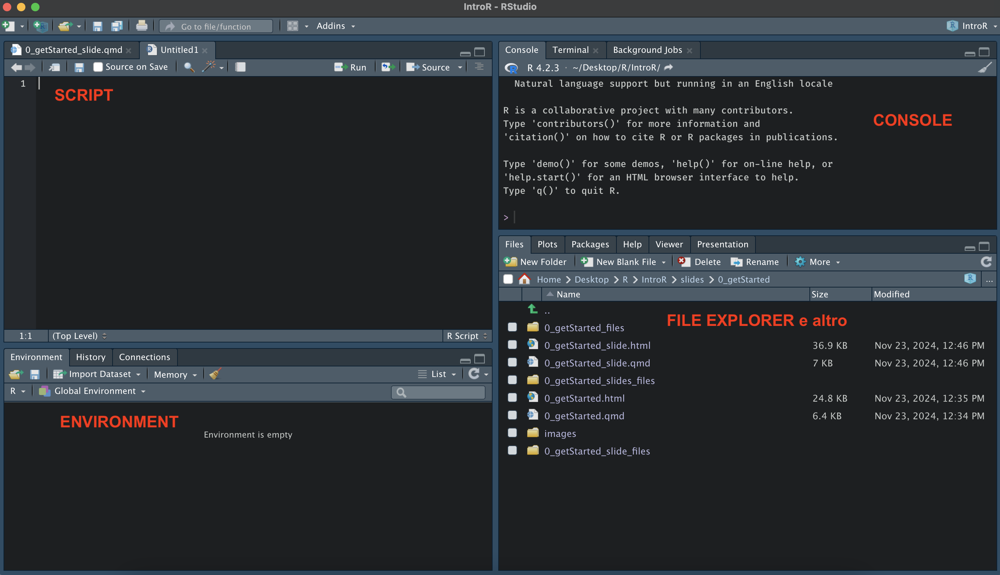
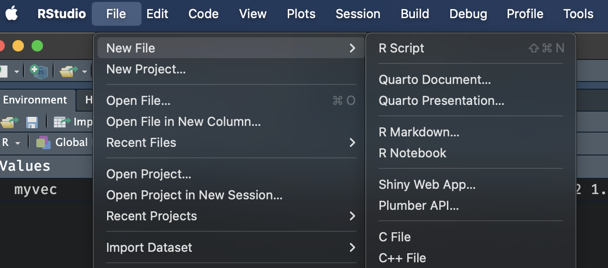
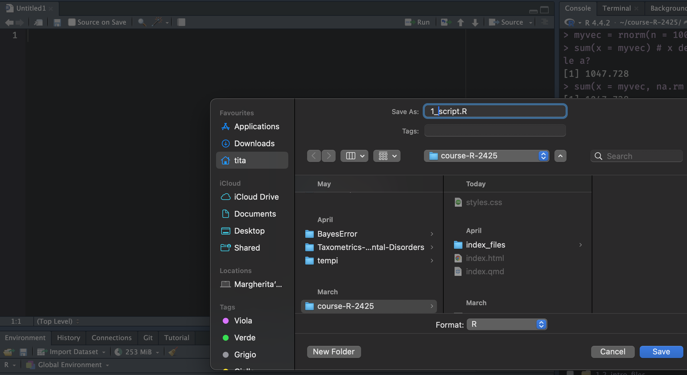

## Ambiente di Lavoro {style="text-align: center;"}

{fig-align="center"}

------------------------------------------------------------------------

**Environment.** La vostra scrivania quando lavorate in R. Contiene tutti gli oggetti (variabili) creati durante la sessione di lavoro.

::: fragment
**Script.** File di testo dove il codice viene salvato e puo essere lanciato in successione. Nello script è possibile combinare codice e commenti (#)

```{r, echo = TRUE}
# assegno ad x il valore 30
x = 30
```
:::

::: fragment
**Working Directory.** La posizione (cartella) sul vostro PC dove R sta lavorando e nella quale R si aspetta di trovare i vostri file, se non specificato altrimenti.
:::

## Come lavorare in R

Creiamo uno script:

{fig-align="center"}

## Come lavorare in R

Salviamo:

{fig-align="center"}

## Working Directory

Dove sta lavorando R ?

<br/>

```{r, echo = TRUE}
getwd()
```

## Path Assoluto

PC

```         
|- Users
    | 
    |- tita 
        |
        |- course-R-2425
            |
            |- materials
                |
                |- 1_intro
```

<br/> Io sto lavorando dentro la cartella 1_intro.

## Path Relativo (alla working directory)

1. Cambia la working directory attraverso il comando `setwd`:

```{r, echo=TRUE, eval=FALSE}
setwd('/Users/tita/Desktop')
```


2. Scarica il file [prova.csv](https://github.com/arca-dpss/course-R-2425/blob/main/materials/1_intro/prova.csv) ed inseriscilo nella cartella.

::: fragment
3. Dato che stiamo lavorando dentro la cartella, se vogliamo caricare un file che si trova dentro questa cartella possiamo scrivere semplicemente il nome del file tra virgolette, ed utilizzare per esempio la funzione `read.csv`:

```{r, echo=TRUE, warning=FALSE}
data = read.csv("prova.csv")

head(data, n = 4) #mostra le prime righe del dataset
```
:::

## Come cambiare la working directory?

Se però vogliamo caricare un file che si trova in un'altra posizione dobbiamo chiamarlo attraverso il path assoluto:

```{r, echo=TRUE, warning=FALSE}
data = read.csv("/Users/tita/course-R-2425/materials/1_intro/prova.csv")
head(data, n = 4) #mostra le prime righe del dataset
```

<br/>

Oppure, prima cambiare la working directory attraverso il comando `setwd` e poi caricare il file.


## La soluzione migliore?

Creare un R project!

-   permettono di impostare la working directory in automatico
-   permettono di usare ***relative path*** invece che ***absolute path***
-   permettono un veloce accesso ad un determinato progetto

# Creiamone uno!
