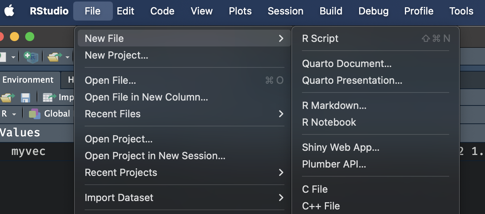
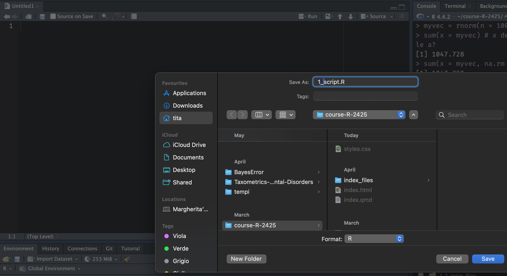

## Working Environment {style="text-align: center;"}

RStudio is divided into **4 main panes**:

{fig-align="center" width="2810"}

------------------------------------------------------------------------

**Script.** The text file where you write and save your code. You can run one line at a time (`Ctrl + Enter` / `Cmd + Enter`) or the whole script by clicking `Source`. Comments are added with `#`.

<br/>

**Console.** This is where R runs the code and shows the results. You can type commands directly in the console for quick tests, but they are not saved.

<br/>

**Environment / Temporary desk.** Shows all the **objects** created during the current session.

<br/>

**Miscellaneous.** A multi-purpose pane with several tabs, including the file explorer

------------------------------------------------------------------------

::: callout-note
## Console

Commands in the console are executed but **not saved**.

To run the command → `Enter`

The output is immediate and appears in the console.
:::

<br/>

::: callout-note
## Script

You can save scripts with all your commands.

To run the command → `Ctrl + Enter` (`Cmd + Enter` on Mac)

The output is returned in the console.
:::

## How to work in R

Let's create a script:

{fig-align="center"}

## How to work in R

Let's save it:

{fig-align="center"}

## Working Directory

The location (folder) on your PC where R is working and where R expects to find your files, unless specified otherwise.

<br/>

```{r, echo = TRUE}
getwd()
```

## Absolute Path

PC

```
|- Users
    |
    |- tita
        |
        |- course-R-2425
            |
            |- materials
                |
                |- 1_intro
```

<br/> I am working inside the 1_intro folder.

## Relative Path (to the working directory)

1.  Change the working directory with the `setwd` command:

```{r, echo=TRUE, eval=FALSE}
setwd('/Users/tita/Desktop')
```

2.  Download the file [prova.csv](https://github.com/arca-dpss/course-R-2425/blob/main/materials/1_intro/prova.csv) and put it in the folder.

::: fragment
3.  Since we are working inside the folder, if we want to load a file located in this folder we can simply write the file name in quotes and use, for example, the `read.csv` function:

```{r, echo=TRUE, warning=FALSE}
data = read.csv("prova.csv")

head(data, n = 4) # show the first rows of the dataset
```
:::

##

If instead we want to load a file located somewhere else, we need to refer to it through its absolute path:

```{r, echo=TRUE, warning=FALSE}
data = read.csv("/Users/tita/course-R-2425/materials/1_intro/prova.csv")
head(data, n = 4) # show the first rows of the dataset
```

<br/>

::: fragment
Or, first change the working directory with the `setwd` command and then load the file.
:::

## The best solution?

Create an R project!

-   they set the working directory automatically
-   they let you use ***relative paths*** instead of ***absolute paths***
-   they give quick access to a given project

# Let's create one!
