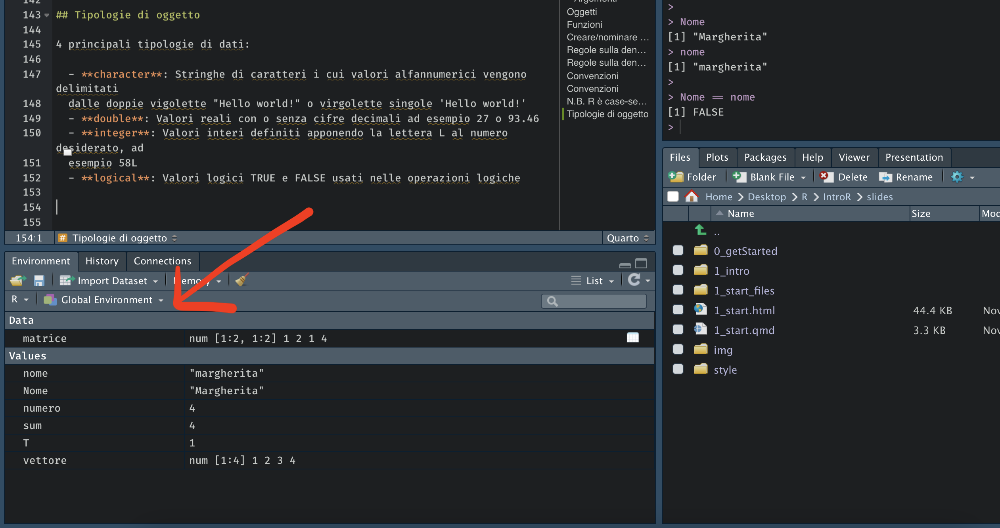
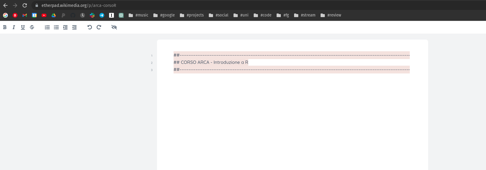

## **Topics**

-   **Objects**
    -   types of objects
    -   creating/naming an object
    -   data types
-   **Operators**
    -   mathematical
    -   relational
    -   logical

# Objects

## Objects

Everything we can create in R is called an object (e.g., numbers, vectors, matrices, functions). <br/>

```{r, echo = TRUE}
number = 4
number
```

```{r, echo = TRUE}
my_vector = c(1,2,3,4)
my_vector
```

```{r, echo = TRUE}
my_matrix = matrix(nrow = 2, ncol = 2, data = my_vector)
my_matrix
```

## Functions

Everything we do in R is calling **functions** on objects.

Functions allow us to **create** and **modify** objects.

```{r, echo = TRUE}
my_vector
mean(x = my_vector)
```

```{r, echo = TRUE}
number
```

```{r, echo = TRUE}
number = mean(my_vector)
number
```

## Creating/naming objects

Objects can be created with either the **`<-`** or the **`=`** command

```{r, echo = TRUE}
x1 = 3 # name = object
x1

x2 <- 3 # name <- object
x2

x1 == x2 # are the two objects identical?
```

You can choose the command you prefer; the important thing is to be consistent.

## Rules for naming objects

-   A name must start with a letter and can contain letters, numbers, underscores ( \_ ), or dots (.).
-   It may also start with a dot (.), but in that case it cannot be followed by a number.

```{r, echo = TRUE, warning=TRUE, error=TRUE}
.3 = 3

.x = 3
```

------------------------------------------------------------------------

-   It must not contain special characters such as #, &, \$, ?, etc.

-   It must not be a reserved word, i.e. one of the words used by R with a special meaning (?reserved).

```{r, echo = TRUE, warning=TRUE, error=TRUE}
function = 3

```

```{r, echo = TRUE,warning=TRUE, error=TRUE}
TRUE = 3

```

```{r, echo = TRUE,warning=TRUE, error=TRUE}
if = 3

```

## Conventions

Some names are not forbidden but are discouraged

```{r, echo = TRUE}
T
TRUE
T == TRUE

T = 1; T

T == TRUE

sum(2,3)

sum = 4; sum
```

------------------------------------------------------------------------

Using "*.*" in object names (for example, "my.data") is fine in **R** but is not allowed in **Python**, where "*.*" is part of the language syntax.

Across languages, the *naming conventions* for longer, multi-word variable names favour **`snake_case`** (for example, "**my_data**") or **`camelCase`** (for example, "**myData**"), and **abbreviations** where appropriate (for example, "**unipdData**" rather than "university_of_padova_dataset").

## R is case-sensitive

<br/>

```{r, echo = TRUE}
Name = "Margherita"

name = "margherita"

Name
name

Name == name
```

## Where are objects stored?

By default, objects are created in the **global environment**, which can be accessed with `ls()` or viewed in R Studio together with some additional information:

{fig-align="center" width="400"}

## Removing objects

We can remove an object from our environment with the **`rm("objectname")`** command.

We can also completely clear/empty our environment with the **`rm(list = ls())`** command.

# Data types

## Data types

-   **`character`**: Character strings whose alphanumeric values are delimited by double quotes "Hello world!" or single quotes 'Hello world!'
-   **`numbers`**:
    -   **`double`**: Real values with or without decimal digits, for example 27 or 93.46
    -   **`integer`**: Integer values defined by appending the letter L to the number, for example 58L

## Mathematical Operators

| Function | What does it do? | Example     | Result |
|----------|------------------|-------------|--------|
| `+`      | addition         | `5.4 + 6.1` | `11.5` |
| `-`      | subtraction      | `9 - 4.3`   | `4.7`  |
| `*`      | multiplication   | `7 * 1.4`   | `9.8`  |
| `/`      | division         | `9/3`       | `3`    |
| `%%`     | remainder        | `9%%2`      | `1`    |
| `^`      | power            | `15 ^ 2`    | `225`  |

------------------------------------------------------------------------

| Function | What does it do?     | Example           | Result |
|----------|----------------------|-------------------|--------|
| `abs`    | absolute value       | `abs(-8)`         | `8`    |
| `sqrt`   | square root          | `sqrt(225)`       | `15`   |
| `exp`    | exponential function | `exp(0)`          | `1`    |
| `log`    | natural logarithm    | `log(1)`          | `0`    |
| `round`  | rounding, integer    | `round(1.738)`    | `2`    |
| `round`  | rounding             | `round(1.738, 2)` | `1.74` |

## Mathematical Operations

The order of operations in R follows the rules of mathematics.

**Examples**

```{r, echo = TRUE}
# Without parentheses
1 + 2 * 3

# With parentheses
(1 + 2) * 3
```

## Relational Operators

In R we can evaluate whether a given relation is true or false. R will evaluate the statement and return **`TRUE`** if the statement is true or **`FALSE`** if the statement is false.

------------------------------------------------------------------------

+---------------+-------------------+-------------------+---------------+
| Function      | Name              | Example           | Result        |
+===============+===================+===================+===============+
| `==`          | equal             | `30 == 30`        | `TRUE`        |
+---------------+-------------------+-------------------+---------------+
| `!=`          | not equal         | `30 != 30`        | `FALSE`       |
+---------------+-------------------+-------------------+---------------+
| `>`/`>=`      | greater/or equal  | `30 > 10`         | `TRUE`        |
|               |                   |                   |               |
|               |                   | `30 >= 10`        | `TRUE`        |
+---------------+-------------------+-------------------+---------------+
| `<`/`<=`      | less/or equal     | `30 < 10`         | `FALSE`       |
|               |                   |                   |               |
|               |                   | `10 <= 10`        | `TRUE`        |
+---------------+-------------------+-------------------+---------------+
| `%in%`        | inclusion         | `10%in%c(1,2,10)` | `TRUE`        |
+---------------+-------------------+-------------------+---------------+

------------------------------------------------------------------------

**It doesn't only work with numbers!**

<br/>

```{r, echo = TRUE}
Name = "Margherita"

name = "margherita"

Name == name
```

<br/> PS. Remember that **`=`** is different from **`==`**

## Logical Operators

In R we can combine several relations to evaluate a given statement.

```{r,echo = TRUE}
x = 30 # Assign the value 30 to x.
```

| Function | Name                    | Example       | Result |
|----------|-------------------------|---------------|--------|
| `&`      | Conjunction (AND)       | `x>25 & x<60` | `TRUE` |
| `|`      | Inclusive disjunction (OR) | `x>25 | x>60` | `TRUE` |
| `!`      | Negation (NOT)          | `!(x<18)`     | `TRUE` |

## Logical Operators

```{r,echo = TRUE}
x = 30 # Assign the value 30 to x.
x
```

::: fragment
```{r, echo=TRUE, eval=FALSE}
x>25 & x>60
```
:::

::: fragment
```{r}
x>25 & x>60
```
:::

::: fragment
```{r, echo=TRUE, eval=FALSE}
x>25 | x>60
```
:::

::: fragment
```{r}
x>25 | x>60
```
:::

::: fragment
```{r, echo=TRUE, eval=FALSE}
!(x>18)
```
:::

::: fragment
```{r}
!(x>18)
```
:::

------------------------------------------------------------------------

**TRUE is equivalent to 1 and FALSE to 0**

```{r,echo = TRUE}
TRUE == 1
TRUE == 2
FALSE == 0
FALSE == 1
```

::: fragment
I create an example vector containing the words home (repeated 4 times) and shop (repeated 2 times):
```{r,echo = TRUE}
example = c(rep("home",times = 4),rep("shop", times = 2)) #?rep
example
```
:::

::: fragment
```{r,echo = TRUE}
# How many words in example are equal to home?
example == "home"
```
:::

::: fragment
```{r,echo = TRUE}
sum(example == "home") # why?
```
:::

## Order of Evaluation

When evaluating whether statements are true, R performs the operations in the following order:

1.  Mathematical operators (e.g., \^, \*, /, +, -, etc.)
2.  Relational operators (e.g., \<, \>, \<=, \>=, ==, !=)
3.  Logical operators (e.g., !, &, \|)

If in doubt about the order in which operations are executed, the best thing to do is to use round brackets ( ) to remove any possible ambiguity.

## Let's practice! {style="text-align: center;"}

<br/> Open this link and keep it open: <https://etherpad.wikimedia.org/p/arca-corsoR>

{fig-align="center" width="800"}
