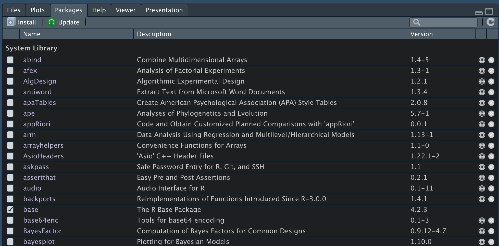
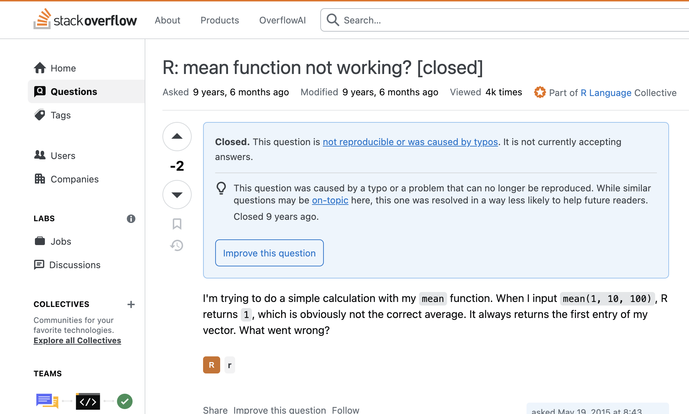

## Functions

Functions are a relatively complex and advanced topic. We will cover them later. Since we use them right from the start (e.g. the `mean` function to compute the mean), it is important to be clear about a few aspects:

-   Functions as objects
-   Mandatory and optional arguments, and defaults
-   Order of arguments
-   Documentation

## Functions

We can think of functions in R in the same way as classic mathematical functions. Given some **input** values, functions perform specific calculations and return the result as **output**.

{fig-align="center"}

## Functions as objects

We have already seen that everything in R is an object. Functions too, although very different from other elements, are created and treated in R as objects. In this example, we create a function that takes **x** as input and **adds** the value **3** to **x**.

The output will depend on the value of x.

```{r, echo=TRUE}
myfun = function(x) {
  return(x + 3)
}

myfun(2)

# myfun(7)
```

::: fragment
```{r}
myfun(7)
```
:::

## Functions as objects

We can create, remove or overwrite them like any other object. We will see later how to create them, but keep in mind that all the functions we use are created as objects and stored in the environment.

## Arguments

Function arguments are what we, as *users*, need to know and set correctly so that the function does what it was designed to do. In the previous example the only argument was x. Let's look at the `help` of the `mean()` function instead.

## Arguments

There are 2 rules for setting these arguments:

-   the order does not matter IF I SPECIFY THE ARGUMENT NAME, e.g. `x = vector`, `na.rm = TRUE`, etc.
-   the order matters IF I DO NOT SPECIFY THE ARGUMENT NAME. I can omit `argument = value`, but I must respect the order in which the function was written.

## Arguments

Let's try to use the `mean()` function:

```{r, error = TRUE, echo=TRUE}
# create a vector by sampling 1000 elements
# from a normal distribution with mean 1 and sd 1
myvec = rnorm(n = 1000, mean = 1, sd = 1)

mean(x = myvec) # x defined, trim and na.rm not defined, so they are equal to?
?mean
```

::: fragment
```{r, echo = TRUE, warning=TRUE, error=TRUE}
mean(x = myvec, na.rm = TRUE) # x defined, na.rm defined

mean(myvec, TRUE) # what happens?
```
:::

## Packages

In R we can install and load additional packages, which simply make available libraries of functions created by other users. To use a package:

-   Install the package with **`install.packages("packagename")`**

-   Load the package with **`library(packagename)`**

-   Access a function without loading the package with **`packagename::functionname()`** (useful if you only need one function or if there are conflicts)

## Packages

{fig-align="center" width="600"}

## How to solve problems in R

In R, errors are:

-   inevitable
-   part of the code itself
-   educational

## R and errors

There are different **alert** levels when we write code:

-   **`messages`**: the function returns something that is useful to know, but everything is fine

-   **`warnings`**: the function informs us about something *potentially* problematic, but (more or less) everything is fine

-   **`errors`**: the function not only informs us about an **error**, but the requested operations were not executed

## How to solve them?

-   Understand the message
-   Read the function documentation
-   Search for the message online
-   Ask for help in dedicated forums

## Function documentation

-   Every function has a documentation page, accessible with `?functionname`, `??functionname` or `help(functionname)`

-   We can also look up the package documentation

-   We can search online for the function name or for the message we get

## Stack overflow

[**Stack overflow**](https://stackoverflow.com/) is a discussion forum about anything involving code (statistics, programming, etc.). It is full of common errors, *How to do ...* questions and extremely useful answers/solutions. In 90% of cases the problem you have is common and a solution already exists.

{fig-align="center" width="600"}

## ChatGPT

**Be careful**

-   Ask the question clearly

-   Make sure you have understood the answer

-   Double-check!
