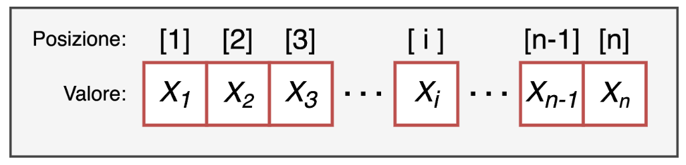

```{r}
set.seed(1111)
```

## Data Structures

-   ***`vectors`***

-   factors

-   lists

-   matrices

-   arrays

-   dataframes

## Vectors

Vectors are a one-dimensional data structure and are the simplest one in R.

{fig-align="center"}

------------------------------------------------------------------------

## Properties of a vector

-   **length**: the number of elements the vector is made of

-   **type**: the type of data the vector is made of. A vector must in fact be made of **elements all of the same type**!

## Properties of the elements of a vector

-   **a value**: the value of the element, which can be of any type, for example a number or a string of characters

-   **a position index**: a positive integer that identifies its position within the vector.

{fig-align="center"}

## Creating a vector

Vectors can be created with the **`c()`** command, writing inside the brackets the values of the elements in the desired order, separated by commas.

```{r, echo=TRUE}
num_vect = c(1,2,3,4)
# you can also use the seq() function
num_vect_seq = seq(from = 1,to = 4, by = 1)
num_vect
num_vect_seq
```

::: fragment
```{r,echo=TRUE}
char_vect = c("R","R","R","ok")
# you can also use the rep() function
char_vect_rep = c(rep("R", times = 3), "ok")
char_vect
char_vect_rep
```
:::

## Vector type

The type of data the vector is made of.

```{r, echo=TRUE}
class(num_vect)
class(char_vect)
```

## Vector type

A vector must be made of **elements all of the same type**!

```{r, echo=TRUE}
wrong = c(1,2,3,"don't know", 4)
class(wrong)
wrong
```

Otherwise you "risk" everything being converted to character.

::: {.fragment}
```{r, echo=TRUE}
correct = c(1,2,3,NA, 4)
class(correct)
correct
```
:::

## is.\* & as.\*

We can test or convert (when possible) the type of a vector with the **`is.`** & **`as.`** functions

::: fragment
A `character` vector

```{r, echo = TRUE}
char_vect
is.character(char_vect)
as.numeric(char_vect) #!!
```
:::

## is.\* & as.\*

A `numeric` vector

```{r, echo = TRUE}
num_vect
is.numeric(num_vect)
as.character(num_vect) #!!
```

::: fragment
A `logical` vector

```{r, echo = TRUE}
logi_vect = c(TRUE,FALSE,TRUE)
is.logical(logi_vect)
```

```{r, echo = TRUE, eval=FALSE}
as.numeric(logi_vect)
```
:::

::: fragment
```{r}
as.numeric(logi_vect)
```
:::

## Vector attributes

Each element of a vector can be given a name.

```{r, echo=TRUE}
num_vect

names(num_vect) # no names assigned

letters[1:4]
names(num_vect) = letters[1:4]

num_vect
```

------------------------------------------------------------------------

Every object is characterized by a dimension (**`dim()`**); however, since a vector is one-dimensional, we use the **`length()`** command to get the length of the vector

```{r, echo=TRUE}
num_vect

dim(num_vect)

length(num_vect)
```

## Indexing

We can select, remove and extract elements simply by using the position index inside square brackets vector\[pos\] .

```{r, echo=TRUE}
# Create a vector of 10 random numbers drawn between 1 and 100
my_vect = round(runif(n = 10,min = 1, max = 100))
my_vect
```

::: fragment
```{r, echo=TRUE}
my_vect[1] # extract the first element
```
:::

::: fragment
```{r, echo=TRUE}
my_vect[1:5] # extract the first 5 elements
```
:::

::: fragment
```{r, echo=TRUE}
my_vect[c(1,4,2,9)] # extract elements of our choice
```
:::

::: fragment
```{r, echo=TRUE}
my_vect[length(my_vect)] # last element (why?)
```
:::

## Negative Indexing

In the same way, we can extract all the elements of the vector except some

```{r, echo=TRUE}

my_vect[-c(1)] # all except the first element

my_vect[-c(1:9)] # all except the first 9
```

------------------------------------------------------------------------

If we assign names to the elements of the vector, we can index them by "calling them by name" (less common)

```{r, echo=TRUE}
letters[1:length(my_vect)]
names(my_vect) = letters[1:length(my_vect)]
```

::: fragment
```{r, echo=TRUE}
names(my_vect) # What are the names of the elements of my_vect?
```
:::

::: fragment
```{r, echo=TRUE}
my_vect
```
:::

::: fragment
```{r, echo=TRUE}
my_vect["a"] # I want the element of my_vect called "a"
```
:::

::: fragment
```{r, echo=TRUE}
my_vect[1] # I want the first element of my_vect
```
:::

## Logical Indexing

We can select elements of a vector based on specific logical conditions: **`TRUE`** and **`FALSE`**. The idea is that if we have a vector of length **n** and another logical vector of length **n**, all the **`TRUE`** elements will be selected:

```{r, echo=TRUE}
numbers = 1:7
numbers
```

::: fragment
```{r,echo=TRUE}
numbers>2 & numbers<5
```
:::

::: fragment
```{r, echo=TRUE, eval=FALSE}
numbers[numbers>2 & numbers<5]
```
:::

::: fragment
```{r}
numbers[numbers>2 & numbers<5]
```
:::

::: fragment
```{r,echo=TRUE}
as.numeric(numbers>2 & numbers<5)
```
:::

------------------------------------------------------------------------

It doesn't only work for the elements of the numbers vector, but for any vector!

```{r, echo=TRUE}
my_letters = letters[1:7]
my_letters
```

::: fragment
```{r, echo=TRUE}
numbers>2 & numbers<5
```
:::

::: fragment
```{r, echo=TRUE, eval=FALSE}
my_letters[numbers>2 & numbers<5]
```
:::

::: fragment
```{r,echo=FALSE}
my_letters[numbers>2 & numbers<5]
```
:::

## Positional Indexing

With the `which()` function we can get the positions associated with a logical selection:

```{r, echo=TRUE}
my_letters
which(my_letters == "a")
```

## Positional Indexing

Example:

```{r, echo=TRUE}
# create a vector of 10 random integers between 1 and 40
my_vect = round(runif(10, min = 1, max = 40))
my_vect
```

What is the difference between these 2 commands?

```{r, echo=TRUE}
which(my_vect > 20)
```

```{r, echo=TRUE}
my_vect[which(my_vect > 20)]
```

## Indexing and Assignment

Indexing can also be useful to assign a value to a given element of the vector:

```{r, echo=TRUE}
my_letters
```

::: fragment
```{r, echo=TRUE}
my_letters[1] = "z"
my_letters
```
:::

::: fragment
```{r, echo=TRUE}
my_letters[9] = "i"
my_letters
```
:::

## Indexing and Assignment

I replace the NA value with the missing letter

```{r, echo=TRUE}
my_letters
```

```{r, echo=TRUE}
is.na(my_letters) # are there elements of my_letters = NA?
```

::: fragment
```{r, echo=TRUE}
which(is.na(my_letters)) # in which positions are these elements?
```
:::

::: fragment
```{r, echo=TRUE}
# indeed, if I look at the indicated position
my_letters[is.na(my_letters)]
my_letters[which(is.na(my_letters))]  # equivalent
```
:::

::: fragment
```{r, echo=TRUE}
my_letters[is.na(my_letters)] = "h" # replace NA with the missing letter
my_letters
```
:::

# Mathematical operations on vectors

## Mathematical operations on vectors

We can perform operations on vectors, applying the same operation to all the elements of the vector (element-wise)

```{r, echo=TRUE}

new_vect = rep(2:4, each = 2)
new_vect

# you can perform any operation
new_vect/2
log(new_vect)
exp(new_vect)

```

## Summary Statistics

The most common operations are, for example, the mean `mean()`, the standard deviation `sd()`, the median `median()`, the maximum `max()` and minimum `min()` values.

```{r, echo=TRUE}
# create a vector by sampling 1000 values from a normal distribution
new_vect = rnorm(n = 1000, mean = 1, sd = 4)
mean(new_vect)
sd(new_vect)
median(new_vect)
summary(new_vect)
```

## Summary Statistics

You can also use the `describe` function from the `psych` package:

```{r, echo=TRUE}
psych::describe(new_vect)
```

## NA values

Sometimes (very often) we may have missing data

```{r, echo=TRUE}

new_vect[1] = NA # Assign NA to the first element of the vector

mean(new_vect) # the mean cannot be computed!

mean(new_vect, na.rm = TRUE) # solution!

```

## Frequencies

Another common operation performed on vectors (and on other data structures) is counting frequencies

```{r, echo = TRUE}

# let's go back to the vector created at the beginning of the lesson
char_vect

# with the table function we can compute frequencies
table(char_vect)

# remember that R is case-sensitive!
char_vect[1] = "r"
char_vect

table(char_vect)

```

## Let's practice! {style="text-align: center;"}

<br/> Open this link and keep it open:

<https://etherpad.wikimedia.org/p/arca-corsoR>
