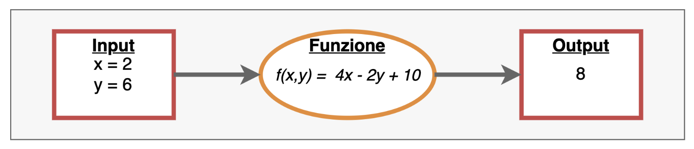
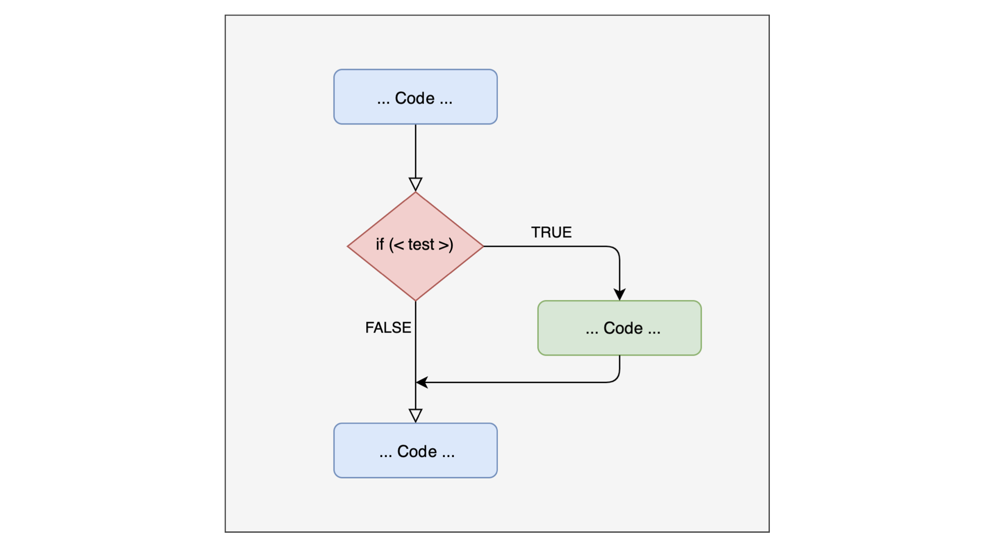
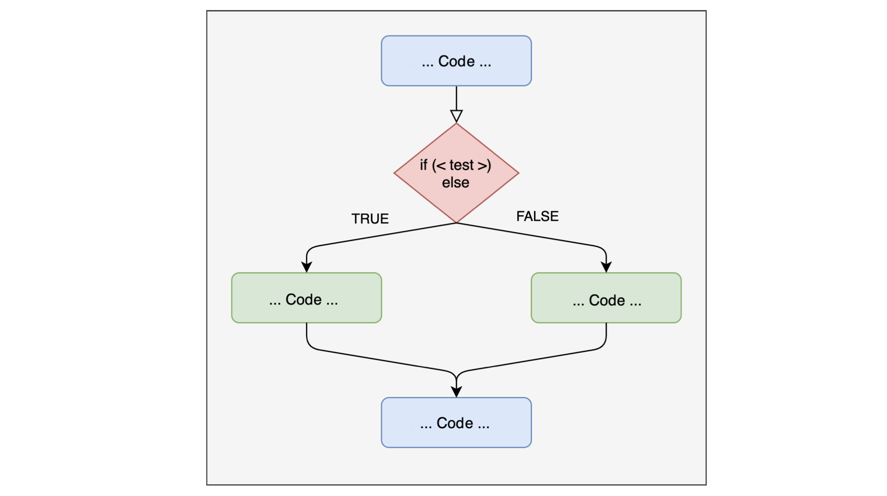

## Programming in R

We will look at the main programming constructs and how they are applied in R. Many of the concepts presented are general, so they also apply to other programming languages. Here we will cover the most basic aspects; for more advanced applications we suggest the book: [Advanced R](https://adv-r.hadley.nz/)

## Topics

-   Programming constructs

-   Conditional programming

-   Iterative programming

## Functions

Just like mathematical functions, a function in programming abstracts a series of operations (in our case a portion of code): given some **inputs**, it performs a series of operations and returns some **outputs**.

{fig-align="center"}

## Functions - Creation

The command used to create a function in R is **`function()`**, followed by a pair of curly braces **`{ }`** inside which we write the **body** of the function:

```{r, echo=TRUE}

myfun_sum = function(x,y){ # arguments

  x + y  # body

  }

myfun_sum(2,3)
```

The function I created takes x and y as **input**, **adds** them, and returns the result as **output**.

## Functions - Creation

We can perform many different operations inside a single function. It is better to use the **`return()`** command to explicitly define the output we want, for example...

```{r, echo=TRUE}

myfun = function(x,y, name){

  # body
  z = x + y  # add x and y
  id = paste(z, name, sep = "_") # create a code

  # output
  return(id)
}

myfun(2,3, "carlo")
```

## Functions - Creation

Let's take a repetitive operation often performed in data analysis: **standardizing** a variable (transforming it into z scores), i.e. **subtracting** its **mean** $\mu_x$ from a **vector x** of observations and then **dividing** by the **standard deviation** $\sigma_x$ :

$$
x_z = \frac{x - \mu_x}{\sigma_x}
$$

## Functions - Creation

To create this function we need to define:

-   **arguments**: variables to be defined (if not already defined)

-   **body**: the operations the function must perform using the arguments

-   **output**: what the function must return as a result

## Functions - Creation

### Arguments

The **arguments** are the **variable** parts of the function that are defined and then needed to run the function itself. In our function the only argument is the **input** **vector**. Just like **`mean`** and **`sd`**, we can add a second argument indicating whether to remove NAs:

```{r, echo=TRUE}
z_score = function(x, na.rm = FALSE){ # arguments
  # body
  # output
}
```

## Functions - Creation

### Body

The **body** of the function contains the **operations** to perform using the input arguments. In our case we need to subtract the mean and divide by the standard deviation.

```{r, echo=TRUE}

z_score = function(x, na.rm = FALSE){ # arguments

  (x - mean(x, na.rm = na.rm)) / sd(x, na.rm = na.rm)
  # output
}
```

## Functions - Creation

### Output

The output is the result the function returns after performing all the operations. In our case we want the function to return the vector transformed into z scores. As we saw before, we can use the **`return()`** function, which explicitly tells the function what to return:

```{r, echo=TRUE}

z_score = function(x, na.rm = FALSE){ # arguments

  xcen = (x - mean(x, na.rm = na.rm)) / sd(x, na.rm = na.rm)

  return(xcen)

}

```

## Functions - Creation

We have now created this function, which becomes an object in our ***environment***, and we can use it

```{r, echo=TRUE}
# create a vector x
vect = runif(n = 100, min = 1, max = 10)

mean(vect) # mean

sd(vect)   # standard deviation

# standardize
vec0 = z_score(vect) # by default na.rm is set to FALSE

round(mean(vec0),2) # mean 0

sd(vec0) # standard deviation 1

```

## Functions - tips

-   Curly braces **`{}`** can be omitted if the code is all on the same line
-   **`return()`** can be omitted if the last line is the desired output

::::: columns
::: {.column width="42%"}
```{r, echo=TRUE}
z_score1 = function(x){
  xcen = (x - mean(x))/sd(x)
  return(xcen)
}
z_score1(vect[1:5])
```
:::

::: {.column width="58%"}
```{r, echo=TRUE}
z_score2 = function(x) (x - mean(x)) / sd(x)
z_score2(vect[1:5])
```
:::
:::::

## Conditional programming - **`if`**

In programming we usually need not only to perform a series of operations BUT to perform operations depending on some conditions.

## Conditional programming - **`if`**

The concept of **if** ***condition*** **then** do ***operation*** is translated in programming through what are called **`if`** statements



## **`if`** statement

Let's see an example

```{r, echo=TRUE}

myfun_if = function(x){ # argument

  if (x > 0){
    cat("The value is greater than 0\n")
  }
  cat("End of function")
}

myfun_if(10)

myfun_if(-10)

```

## **`if`** statement - **`STOP`**

There is a family of functions with the **`is.`** prefix that returns **`TRUE`** when the object type matches the requested one and **`FALSE`** otherwise.

```{r, echo=TRUE, error=TRUE}

myfun_stop = function(x){ # argument

  if (!is.numeric(x)) { # useful when we want to prevent the function from running
    stop("the vector must be numeric")
  }
  mean(x, na.rm = TRUE)
}

x = 1:10  # numeric vector
y = letters[1:10] # character vector

myfun_stop(x)
myfun_stop(y)

```

## **`if...else`**

Using a single **`if`** may not be enough in some situations. Above all because we can see the **`if`** as a **temporary detour** from the main script that is taken only if a condition is true; otherwise the script goes on.

## **`if...else`**

If we want a more "symmetric" structure, we can perform some operations if the condition is true (**`if`**) and others for all the other scenarios (**`else`**).

{fig-align="center"}

## **`if...else`**

Let's see an example

```{r, echo=TRUE}

myfun_ifelse = function(x){ # argument

  if (x > 0){
    cat("The value is greater than 0\n")
  }
  else{
    cat("The value is less than 0\n")
  }
  cat("End of function")
}

myfun_ifelse(10)

myfun_ifelse(-10)

```

## **`if...else`** - nested

```{r, echo=TRUE}

myfun_ifelse = function(x){ # argument
  if (x > 2){
    cat("The value is greater than 2\n")
  }
  else if (x <= 2 & x >= 0){
    cat("The value is between 0 and 2\n")
  }
  else{
     cat("The value is less than 0\n")
  }
}

myfun_ifelse(2.3)
myfun_ifelse(-1)
myfun_ifelse(1.4)

```

## Conditional programming

To understand which conditional structure to use, it is important to understand the problem we need to solve well. Let's take an example: imagine we have 2 types of data in R, strings and numbers. In this case it is enough to have an **`if statement`** that checks whether the element is a string/number and performs a given operation.

## Conditional programming

Let's write a function that returns the mean when the vector is numeric, and the frequency table otherwise.

```{r, echo=TRUE}
my_summary =  function(x){

    if(is.numeric(x)){
      return(mean(x))

    }else{
      return(table(x))
      }
  }
```

## Conditional programming

Let's test the function

```{r, echo=TRUE}
x = 1:7
my_summary(x)

x = c(rep(c("A","B"), 3), "C")
my_summary(x)

```

## Conditional programming

One limitation of **`if statements`** is that they only work on a **single value** (i.e. they are not vectorized). So, while the **`my_summary`** function works because it evaluates whether the whole vector is numeric (**`is.numeric()`**)...

## Conditional programming

If we wanted to use the **`myfun_if`** function ...

```{r, echo=TRUE}
cat(deparse(myfun_if), sep = "\n")
```

it would not work...

```{r, echo=TRUE, error=TRUE}

x = 1:7

myfun_if(x)

```

## Conditional programming

The vectorized version is obtained with the **`ifelse()`** function, whose arguments are the condition to test, the output if the condition is **`TRUE`**, and the output if it is **`FALSE`**

```{r, echo=TRUE}
x

ifelse(x < 5, "x is less than 5", "x is greater than 5")

```

## Conditional programming

When we need to test several alternatives we can create nested **`ifelse()`**. Imagine we have an **age** vector and want to create another vector where age is divided into **3 groups**: child, adult, elderly:

```{r, echo=TRUE}
age = round(runif(10, 3, 80)) # sample from a uniform distribution from 3 to 80
age


age_ifelse = ifelse(age < 18,
                    yes = "child",
                    no = ifelse( age >= 18 & age < 60, "adult", "elderly"))
age_ifelse
```

## **`dplyr::case_when`**

When there are many conditions to test (roughly \> 3), writing many nested ifelse() can be tedious. We can then use the **`dplyr::case_when()`** function from the *`dplyr`* package, which is a generalization of ifelse():

```{r,echo=TRUE, message=FALSE}
age_case_when = dplyr::case_when(age < 18 ~ "child",
                                 age >= 18 & age < 60 ~ "adult",
                                 TRUE ~ "elderly")
# TRUE identifies "everything else"
```

the results are identical...

```{r, echo=TRUE}
all.equal(age_case_when, age_ifelse)
```

## **`dplyr::case_when`**

Recoding the values of a variable, for example reversing the items of a questionnaire, is easily done with **`dplyr::case_when()`**:

```{r, echo=TRUE}
item = sample(1:5, size = 20, replace = TRUE) # simulate 20 responses to an item
item
```

```{r, echo=TRUE}
library(dplyr) # load the package so we don't always have to write its name

item_rec = case_when( # recode with 1 = 5, 2 = 4, 3 = 3, 4 = 2, 5 = 1
    item == 1 ~ 5,
    item == 2 ~ 4,
    item == 3 ~ 3,
    item == 4 ~ 2,
    item == 5 ~ 1 )
item_rec
```

## **`dplyr::case_when`**

These functions can also be applied to the variables in a dataframe:

```{r, echo=TRUE}
# create a dataframe with id and age variables
mydf = data.frame(id = factor(1:30), age = sample(14:50, 30))
# save it for later
readr::write_csv(mydf, file = "data/mydf.csv")
# create a third variable with "adolescent", "young", "adult"
mydf$age_cat = factor(case_when(mydf$age > 30 ~ "adult",
                                 mydf$age <= 30 & mydf$age >= 20 ~ "young",
                                 mydf$age < 20 ~ "adolescent",
                                 TRUE ~ "error" # check for coding errors
                                    ))
str(mydf)
```

## Importing a function

We have already seen that the **`library()`** command loads a package, making the functions it contains available. Without needing to create a package, we can still organize our own functions effectively.

## Importing a function

We have two options

-   write the functions in the same script where they are used

-   write a separate script and import all the functions it contains

## Importing a function

Here too it is a matter of style and convenience; in general:

-   if we have many functions, it is better to write them in one or more separate files and then import them at the beginning of the main script

-   if we have few functions, we can keep them in the main script, perhaps in a dedicated section at the beginning

## Importing a function

In the second case it is enough to write the function, and it will be saved as an object in the main environment. For the first scenario, we can use the **`source("utl/script.R")`** function:

```{r, echo=TRUE}
rm(list = ls()) # clear the environment

# load the functions
source("utl/myfun.R")
# now my functions are available and I can use them
ls()
```

## Importing and using a function

Now my functions are available as objects in my environment and I can use them:

```{r, echo=TRUE, message=FALSE}
# load the dataframe saved earlier
mydf_1 = data.frame(readr::read_csv("data/mydf.csv"))
str(mydf_1) # check

# apply the mydf_fun function
mydf_2 = mydf_fun(mydf_1)
head(mydf_2)
readr::write_csv(mydf_2, file = "data/mydf_2.csv") # save it for later
```

## Now let's practice! {style="text-align: center;"}

<br/> Open this link and keep it open:

<https://etherpad.wikimedia.org/p/arca-corsoR>
