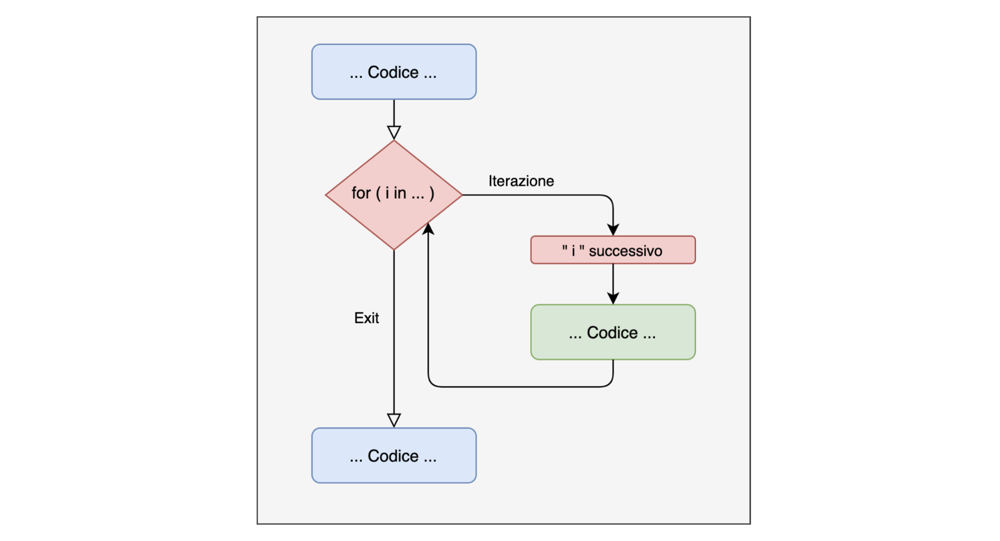
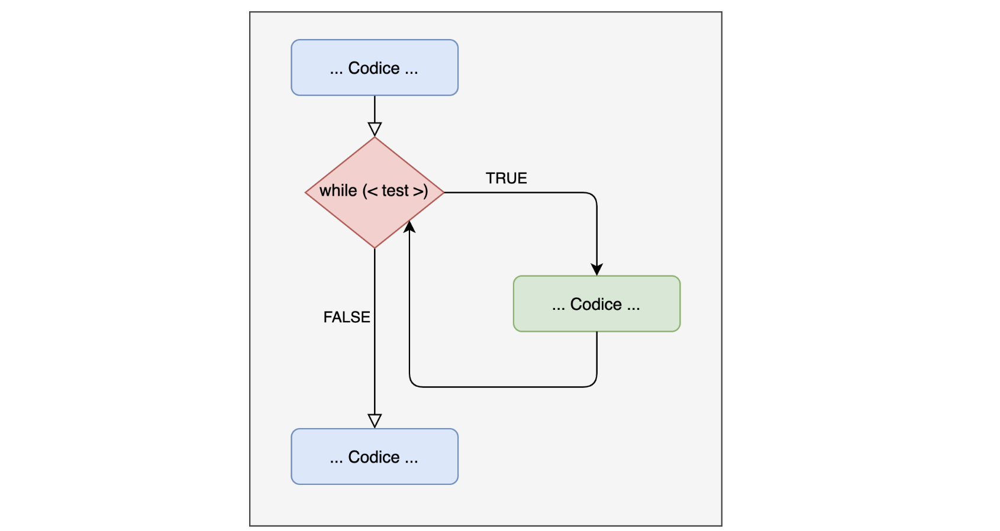

## Programmazione iterativa

Il concetto di iterazione è alla base di qualsiasi operazione nei linguaggi di programmazione. In R molte delle operazioni sono vettorizzate. Questo rende il linguaggio più efficiente e pulito MA nasconde il concetto di iterazione.

Ad esempio la funzione **`sum()`** permette di sommare un vettore di numeri.

```{r, echo=TRUE}
# somma i numeri da 1 a 10
sum(1:10)
```

Ma cosa si nasconde sotto?

------------------------------------------------------------------------

Esempio: se io vi chiedo di usare la funzione **`print()`** per scrivere "hello world" nella console 5 volte, come fate?

```{r, echo=TRUE}
msg = "hello world"
print(msg)
print(msg)
print(msg)
print(msg)
print(msg)
```

------------------------------------------------------------------------

Quello che ci manca (e che invece fa la funzione **`sum()`**) è un modo di ripetere una certa operazione, senza effettivamente ripetere il codice manualmente.

Ci sono vari costrutti che ci permettono di ripetere operazioni, i più utilizzati sono:

-   Ciclo **`for`**

-   Ciclo **`while`**

-   Ciclo **`repeat`**

-   **`*apply`** family

## Il ciclo **`for`**

{fig-align="center"}

------------------------------------------------------------------------

Il ciclo **`for`** è una struttura che permette di ripetere un numero finito e pre-determinato di volte una certa porzione di codice.

La scrittura di un ciclo for è:

```{r, echo=TRUE, error}
n = 10
for(i in 1:n){
# quali operazioni
}
```

Se voglio stampare una cosa 5 volte, posso tranquillamente usare un ciclo for:

```{r, echo=TRUE}
for(i in 1:5){
print(paste("hello word", i, sep = "_"))
}
```

------------------------------------------------------------------------

## Scomponiamo il ciclo **`for`**

-   **`for(){ }`**: è l'implementazione in R (in modo simile all'if statement)

-   **`i`**: questo viene chiamato iteratore o indice. E' un indice generico che può assumere qualsiasi valore e nome. Per convenzione viene chiamato i, j etc. Questo tiene conto del numero di iterazioni che il nostro ciclo deve fare

-   **`in <valori>`**: questo indica i valori che assumerà l'iteratore all'interno del ciclo

-   **`{ # operazioni }`**: sono le operazioni che i ciclo deve eseguire

------------------------------------------------------------------------

La potenza del ciclo for sta nel fatto che l'**iteratore** i assume i valori del vettore specificato dopo **`in`**, uno alla volta:

```{r, echo=TRUE}
for(i in 1:10){ 
  print(i)
}
```

------------------------------------------------------------------------

## **`For`** con iteratore vs senza

::::: columns
::: {.column width="50%"}
**`i`** rappresenta l'indice degli elementi del vettore vec

```{r, echo=TRUE}
vec=1:5

for(i in 1:length(vec)){ 
  
  print(vec[i])

  }
```
:::

::: {.column width="50%"}
**`i`** rappresenta direttamente ogni elemento del vettore vec

```{r, echo=TRUE}
vec=1:5

for(i in vec){ 
  
  print(i)

}
```
:::
:::::

## Ciclo **`while`**

Il ciclo **`while`** utilizza una condizione logica e non un iteratore e un range di valori come nel for. Il ciclo continuerà fino a che la condizione è **`TRUE`**:

{fig-align="center"}

------------------------------------------------------------------------

Provate a scrivere questo ciclo **`while`** e vedere cosa succede e capire perchè accade

```{r, echo=TRUE, eval=FALSE}
x = 10

while (x < 15) { 

  print(x)

}
```
   


------------------------------------------------------------------------

Il ciclo **`while`** è un ciclo non pre-determinato e quindi necessita sempre di un modo per essere interrotto, facendo diventare la condizione falsa.

```{r, echo=TRUE}
x = 5

while (x < 15) { 
  print(x)
  x = x + 1 
}
```

## Ciclo **`repeat`**

La logica del ciclo **`repeat`** è molto simile a quella del ciclo **`while`**, ma con 3 importanti differenze:

1)  esegue sempre almeno un'interazione

2)  enfatizza la ripetizione fino a che una condizione non viene raggiunta

3)  utilizza il comando **`break`** per terminare

## Ciclo **`repeat`**

Lancia il dado finchè non viene fuori 6:

```{r, echo=TRUE}
repeat{
  lancia_dado = sample(1:6, 1)
  print(lancia_dado)
  if(lancia_dado == 6) break
}
```

## **`repeat`** vs. **`while`**

**`repeat`** valuta la condizione una volta **finita** l'iterazione, mentre **`while`** all'**inizio**. Se la condizione non è **`TRUE`** all'inizio, il while non parte mentre repeat si:

::::: columns
::: {.column width="50%"}
```{r, echo=TRUE}
i=1
repeat { 
  print(i)
  i=i+1 
  if(i > 3)break
  }
```
:::

::: {.column width="50%"}
```{r, echo=TRUE}
i=1
while (i < 4) { 
  print(i)
  i=i+1 
  }
```
:::
:::::

## Esempio funzione **`sum()`**

Immaginiamo di non avere la funzione **`sum()`** e di volerla ricreare, come facciamo? Idee?

## Somma come iterazione

Scomponiamo concettualmente la somma, sommiamo i numeri da 1 a 10:

-   prendo il primo e lo sommo al secondo (somma = 1 + 2)

-   prendo la somma e la sommo al 3 elemento somma = somma + 3 ...

In pratica abbiamo:

-   il nostro vettore da sommare

-   un oggetto somma che accumula progressivamente le somme precedenti

------------------------------------------------------------------------

## Somma come iterazione

```{r, echo=TRUE}
somma = 0 # inizializziamo la somma a 0
x = 1:10 #vettore x 

for(i in 1:length(x)){ # per tutta la lunghezza di x = 1:10 
  somma = somma + x[i]
}
```

------------------------------------------------------------------------

Mettiamo tutto dentro una funzione (i.e., creo una funzione che replichi quello che fa la funzione somma)

```{r, echo=TRUE}
my_sum = function(x){
  somma = 0 # inizializziamo la somma a 0
  for(i in seq_along(x)){  # equivalente a 1:length(x)
    somma = somma + x[i]
  }
  return(somma)
}

x = rnorm(100, mean = 0, sd = 1)

my_sum(x)

sum(x)
```

------------------------------------------------------------------------

## Iterazione, applicazioni

Il ciclo **`for`** è anche utile per simulare dei dati per esempio. Supponiamo di avere una variabile y (reddito) che dipenda dall'età:

1. Carico il dataset che ho creato:

```{r, echo=TRUE}
mydf = read.csv(file = "data/mydf_2.csv") #carico il dataset 

str(mydf)
```

------------------------------------------------------------------------

2. Simulo, attraverso un ciclo **`for`** , la variabile **y** (reddito) assumendo che dipenda da **age_z** (età):

```{r, echo=TRUE}
set.seed(111) # per riproducibilità

niter = 1000
res_all = rep(NA, niter)    # tutti gli effetti stimati
p_val = rep(NA, niter)      # tutti i p-value

# Dati osservati
age_z = mydf$age_z
eff_eta = .2 #effetto età
n_obs = length(age_z)

for(i in 1:niter) {
  y = 0 + eff_eta * age_z + rnorm(n_obs, 0, 1) # aggiungo sempre un pò di rumore
  
  # modello lineare
  mod = lm(y ~ 1 + age_z) 
  
  # estraggo stima effetto
  res_all[i] = coef(mod)[2] 
  
  # p-value di age_z
  p_val[i] = summary(mod)$coefficients[2, 4]
}

```

------------------------------------------------------------------------

Risultato:

```{r, echo=TRUE}
# Filtra solo risultati significativi
res_sig = res_all[p_val <= 0.05]

# Statistiche descrittive
cat("Proporzione significativi = Power:", mean(p_val <= 0.05), "\n")
cat("Media tutti gli effetti:", mean(res_all), "\n")
cat("Media effetti significativi:", mean(res_sig), "\n")
```


------------------------------------------------------------------------


```{r}
# Plot comparativo con par(mfrow)
par(mfrow = c(1, 2))

# Istogramma di TUTTI i risultati
hist(res_all, 
     main = "Tutti i risultati", 
     xlab = "Effetto stimato",
     col = "lightblue",
     xlim = range(res_all))
abline(v = eff_eta, col = "red", lwd = 2, lty = 2)  # vero effetto

# Istogramma solo risultati SIGNIFICATIVI
hist(res_sig, 
     main = "Solo risultati significativi (p <= 0.05)", 
     xlab = "Effetto stimato",
     col = "lightgreen",
     xlim = range(res_all))
abline(v = eff_eta, col = "red", lwd = 2, lty = 2)  # vero effetto
```


------------------------------------------------------------------------


Proprio grazie al for loop è possibile effetuare una ***power simulation***.

Per saperne di più date un'occhiata a questa [pagina](https://www.memoryandlearninglab.it/workshops-on-data-analysis/)! :)

## Ciclo `for` nested

Una volta compresa la struttura iterativa, si può espandere facilmente inserendo un ciclo dentro un altro:

```{r, echo=TRUE}
for(i in 1:3){ # livello 1
  for(j in 1:3){ # livello 2
      print(paste(i, j))
  }
}
```

------------------------------------------------------------------------

Immaginiamo di avere due gruppi sperimentali (ad esempio, Gruppo di controllo e Gruppo trattamento), ciascuno con 10 partecipanti. Vogliamo misurare una variabile (ad esempio, il tempo di reazione) per ogni partecipante e registrare i risultati in un dataframe:

```{r, echo=TRUE}
# Definire parametri della ricerca
gruppi = c("Controllo", "Trattamento") # Nomi dei gruppi
num_soggetti=10                      # Numero di soggetti per gruppo
tot_soggetti = num_soggetti * length(gruppi)

# Creare un data.frame per memorizzare i dati
res=data.frame(
  
  # Fattore gruppo
  Gruppo = factor(x = rep(gruppi, each = num_soggetti)),
  
  # fattore soggetto 
  Soggetto = factor(x = 1:tot_soggetti),
  
  # Tempo di reazione vettore numerico con rt = 0 
  RT = numeric(tot_soggetti)
)
```

------------------------------------------------------------------------ 
```{r, echo=TRUE}
head(res, 5) # guardo le prime osservazioni di res
tail(res, 5) # guardo le ultime osservazioni di res
```

------------------------------------------------------------------------

```{r, echo=TRUE}
# Ciclo nested per simulare raccolta dati
set.seed(42)  # Per riproducibilità dei dati simulati

k = 1 #iteratore tempi di reazione

# quanti livelli ha Gruppo?
for (i in 1:length(levels(res$Gruppo))) {
  
  # inizio con il primo gruppo che è il gruppo di controllo
  gruppo = levels(res$Gruppo)[i] 
  
  for (j in 1:num_soggetti) { # num_soggetti each gruppo
    
    # è il gruppo di controllo?
    RT = ifelse(gruppo == "Controllo", 
               yes = rlnorm(1, mean = log(.500), sd = .050), 
               no = rlnorm(1, mean = log(.450), sd = .050))
    
    res$RT[k] = RT
    k = k + 1 
  }
}
```

------------------------------------------------------------------------

```{r, echo=TRUE}
str(res)
head(res, 3)
tail(res, 3)
mean(res$RT[res$Gruppo == "Controllo"])
mean(res$RT[res$Gruppo == "Trattamento"])
```


## Ora facciamo un po' di pratica! {style="text-align: center;"}

<br/> Aprite e tenete aperto questo link:

<https://etherpad.wikimedia.org/p/arca-corsoR>
