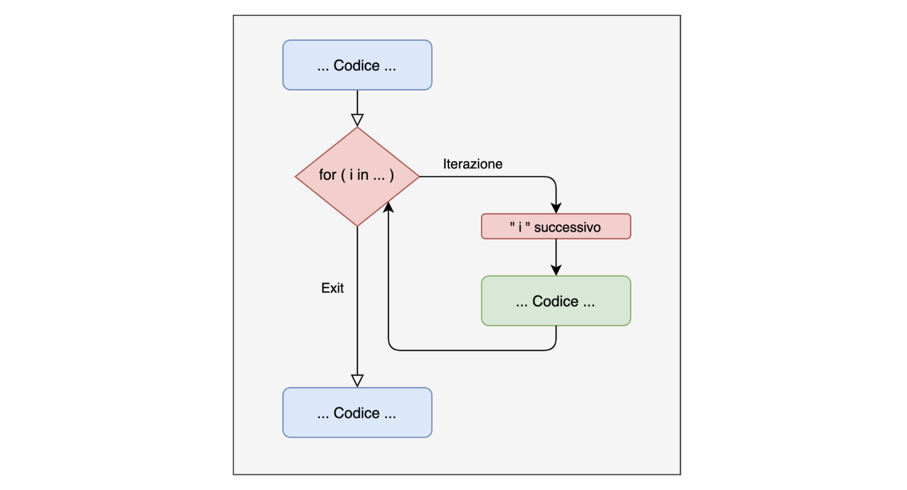
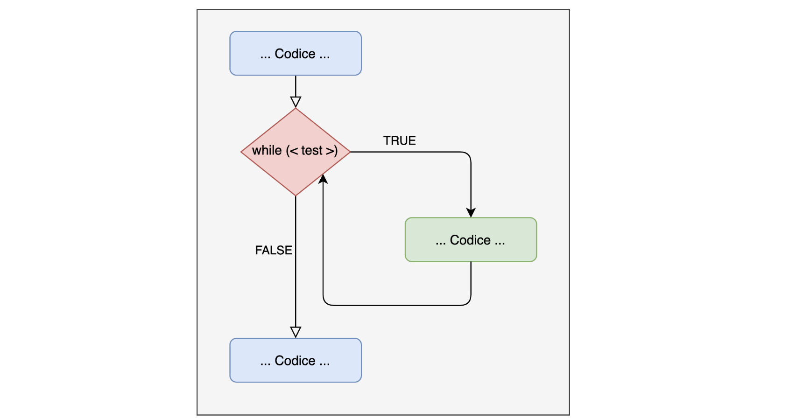

## Iterative programming

The concept of iteration underlies any operation in programming languages. In R many operations are vectorized. This makes the language more efficient and cleaner BUT hides the concept of iteration.

For example, the **`sum()`** function lets us add up a vector of numbers.

```{r, echo=TRUE}
# add up the numbers from 1 to 10
sum(1:10)
```

But what is hidden underneath?

------------------------------------------------------------------------

Example: if I ask you to use the **`print()`** function to write "hello world" in the console 5 times, how would you do it?

```{r, echo=TRUE}
msg = "hello world"
print(msg)
print(msg)
print(msg)
print(msg)
print(msg)
```

------------------------------------------------------------------------

What we are missing (and what the **`sum()`** function does) is a way to repeat a given operation without actually repeating the code manually.

There are several constructs that let us repeat operations; the most used are:

-   The **`for`** loop

-   The **`while`** loop

-   The **`repeat`** loop

-   The **`*apply`** family

## The **`for`** loop

{fig-align="center"}

------------------------------------------------------------------------

The **`for`** loop is a structure that lets us repeat a portion of code a finite, pre-determined number of times.

A for loop is written as:

```{r, echo=TRUE, error}
n = 10
for(i in 1:n){
# which operations
}
```

If I want to print something 5 times, I can simply use a for loop:

```{r, echo=TRUE}
for(i in 1:5){
print(paste("hello world", i, sep = "_"))
}
```

------------------------------------------------------------------------

## Breaking down the **`for`** loop

-   **`for(){ }`**: this is the implementation in R (similar to the if statement)

-   **`i`**: this is called the iterator or index. It is a generic index that can take any value and name. By convention it is called i, j etc. It keeps track of the number of iterations our loop has to do

-   **`in <values>`**: this indicates the values the iterator will take inside the loop

-   **`{ # operations }`**: these are the operations the loop must perform

------------------------------------------------------------------------

The power of the for loop lies in the fact that the **iterator** i takes the values of the vector specified after **`in`**, one at a time:

```{r, echo=TRUE}
for(i in 1:10){
  print(i)
}
```

------------------------------------------------------------------------

## **`For`** with an index vs without

::::: columns
::: {.column width="50%"}
**`i`** represents the index of the elements of the vector vec

```{r, echo=TRUE}
vec=1:5

for(i in 1:length(vec)){

  print(vec[i])

  }
```
:::

::: {.column width="50%"}
**`i`** directly represents each element of the vector vec

```{r, echo=TRUE}
vec=1:5

for(i in vec){

  print(i)

}
```
:::
:::::

## The **`while`** loop

The **`while`** loop uses a logical condition instead of an iterator and a range of values as in the for loop. The loop keeps going as long as the condition is **`TRUE`**:

{fig-align="center"}

------------------------------------------------------------------------

Try writing this **`while`** loop, see what happens and understand why

```{r, echo=TRUE, eval=FALSE}
x = 10

while (x < 15) {

  print(x)

}
```


------------------------------------------------------------------------

The **`while`** loop is not pre-determined, so it always needs a way to be stopped, by making the condition false.

```{r, echo=TRUE}
x = 5

while (x < 15) {
  print(x)
  x = x + 1
}
```

## The **`repeat`** loop

The logic of the **`repeat`** loop is very similar to that of the **`while`** loop, but with 3 important differences:

1)  it always performs at least one iteration

2)  it emphasizes repetition until a condition is met

3)  it uses the **`break`** command to stop

## The **`repeat`** loop

Roll the die until a 6 comes up:

```{r, echo=TRUE}
repeat{
  die_roll = sample(1:6, 1)
  print(die_roll)
  if(die_roll == 6) break
}
```

## **`repeat`** vs. **`while`**

**`repeat`** evaluates the condition at the **end** of the iteration, while **`while`** does it at the **beginning**. If the condition is not **`TRUE`** at the start, while does not run, whereas repeat does:

::::: columns
::: {.column width="50%"}
```{r, echo=TRUE}
i=1
repeat {
  print(i)
  i=i+1
  if(i > 3)break
  }
```
:::

::: {.column width="50%"}
```{r, echo=TRUE}
i=1
while (i < 4) {
  print(i)
  i=i+1
  }
```
:::
:::::

## Example: the **`sum()`** function

Imagine we did not have the **`sum()`** function and wanted to recreate it: how would we do it? Any ideas?

## Sum as iteration

Let's break the sum down conceptually; we add up the numbers from 1 to 10:

-   I take the first one and add it to the second (total = 1 + 2)

-   I take the total and add it to the 3rd element: total = total + 3 ...

In practice we have:

-   our vector to sum

-   a total object that progressively accumulates the previous sums

------------------------------------------------------------------------

## Sum as iteration

```{r, echo=TRUE}
total = 0 # initialize the total to 0
x = 1:10 # vector x

for(i in 1:length(x)){ # for the whole length of x = 1:10
  total = total + x[i]
}
```

------------------------------------------------------------------------

Let's put everything inside a function (i.e., I create a function that replicates what the sum function does)

```{r, echo=TRUE}
my_sum = function(x){

  total = 0 # initialize the total to 0

  for(i in seq_along(x)){  # equivalent to 1:length(x)

    total = total + x[i]

    }

  return(total)

}

x = rnorm(100, mean = 0, sd = 1)

my_sum(x)

sum(x)
```

------------------------------------------------------------------------

## Iteration, applications

The **`for`** loop is also useful, for example, to simulate data. Suppose we have a variable y (income) that depends on age:

1. I load the dataset I created:

```{r, echo=TRUE}
mydf = read.csv(file = "data/mydf_2.csv") # load the dataset

str(mydf)
```

------------------------------------------------------------------------

2. With a **`for`** loop, I simulate the variable **y** (income) assuming it depends on **age_z** (age):

```{r, echo=TRUE}
set.seed(111) # for reproducibility

niter = 1000
res_all = rep(NA, niter)    # all estimated effects
p_val = rep(NA, niter)      # all p-values

# Observed data
age_z = mydf$age_z
eff_age = .2 # age effect
n_obs = length(age_z)

for(i in 1:niter) {
  y = 0 + eff_age * age_z + rnorm(n_obs, 0, 1) # always add some noise

  # linear model
  mod = lm(y ~ 1 + age_z)

  # extract the effect estimate
  res_all[i] = coef(mod)[2]

  # p-value of age_z
  p_val[i] = summary(mod)$coefficients[2, 4]
}

```

------------------------------------------------------------------------

Result:

```{r, echo=TRUE}
# Keep only significant results
res_sig = res_all[p_val <= 0.05]

# Descriptive statistics
cat("Proportion significant = Power:", mean(p_val <= 0.05), "\n")
cat("Mean of all effects:", mean(res_all), "\n")
cat("Mean of significant effects:", mean(res_sig), "\n")
```


------------------------------------------------------------------------


```{r}
# Side-by-side plots with par(mfrow)
par(mfrow = c(1, 2))

# Histogram of ALL results
hist(res_all,
     main = "All results",
     xlab = "Estimated effect",
     col = "lightblue",
     xlim = range(res_all))
abline(v = eff_age, col = "red", lwd = 2, lty = 2)  # true effect

# Histogram of SIGNIFICANT results only
hist(res_sig,
     main = "Significant results only (p <= 0.05)",
     xlab = "Estimated effect",
     col = "lightgreen",
     xlim = range(res_all))
abline(v = eff_age, col = "red", lwd = 2, lty = 2)  # true effect
```


------------------------------------------------------------------------


It is precisely thanks to the for loop that we can run a ***power simulation***.

To learn more, have a look at this [page](https://www.memoryandlearninglab.it/workshops-on-data-analysis/)! :)

## Nested `for` loops

Once you understand the iterative structure, you can easily extend it by putting a loop inside another one:

```{r, echo=TRUE}
for(i in 1:3){ # level 1

  for(j in 1:3){ # level 2

      print(paste(i, j))

  }

}
```

------------------------------------------------------------------------

Imagine we have two experimental groups (for example, a Control group and a Treatment group), each with 10 participants. We want to measure a variable (for example, reaction time) for each participant and record the results in a dataframe:

```{r, echo=TRUE}
# Define the study parameters
groups = c("Control", "Treatment") # Group names
n_subj=10                          # Number of subjects per group
tot_subj = n_subj * length(groups)

# Create a data.frame to store the data
res=data.frame(

  # Group factor
  Group = factor(x = rep(groups, each = n_subj)),

  # Subject factor
  Subject = factor(x = 1:tot_subj),

  # Reaction time: numeric vector with rt = 0
  RT = numeric(tot_subj)
)
```

------------------------------------------------------------------------
```{r, echo=TRUE}
head(res, 5) # look at the first observations of res
tail(res, 5) # look at the last observations of res
```

------------------------------------------------------------------------

```{r, echo=TRUE}
# Nested loop to simulate data collection
set.seed(42)  # For reproducibility of the simulated data

k = 1 # reaction time iterator

# how many levels does Group have?
for (i in 1:length(levels(res$Group))) {

  # start with the first group, which is the control group
  group = levels(res$Group)[i]

  for (j in 1:n_subj) { # n_subj for each group

    # is it the control group?
    RT = ifelse(group == "Control",
               yes = rlnorm(1, mean = log(.500), sd = .050),
               no = rlnorm(1, mean = log(.450), sd = .050))

    res$RT[k] = RT
    k = k + 1
  }
}
```

------------------------------------------------------------------------

```{r, echo=TRUE}
str(res)
head(res, 3)
tail(res, 3)
mean(res$RT[res$Group == "Control"])
mean(res$RT[res$Group == "Treatment"])
```


## Now let's practice! {style="text-align: center;"}

<br/> Open this link and keep it open:

<https://etherpad.wikimedia.org/p/arca-corsoR>
